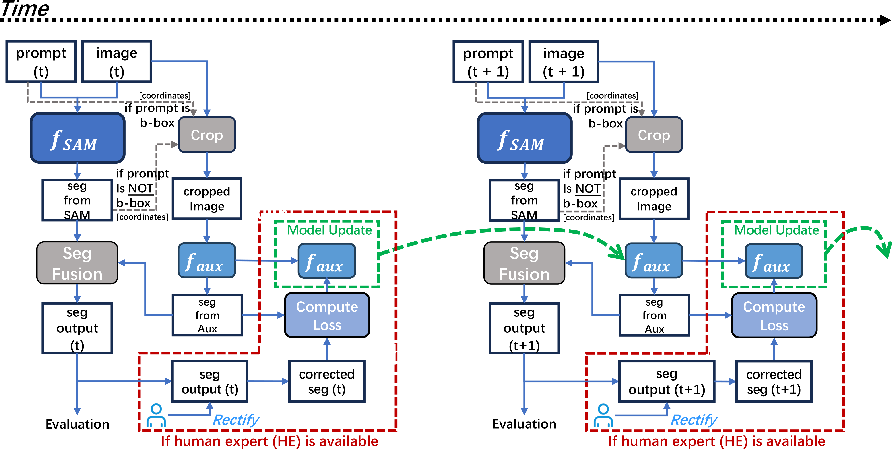

# Paper

[Improving Segment Anything on the Fly: Auxiliary
Online Learning and Adaptive Fusion for Medical
Image Segmentation ](https://arxiv.org/abs/2406.00956)<br/>




# Datasets
download the datasets and make them with this format
```
.
├── TestDatasets
│   ├── BUSI
│   │   ├── benign
│   │   └── malignant
│   ├── fluidchallenge
│   │   ├── cirrus
│   │   ├── spectralis
│   │   └── topcon
│   ├── Polyp
│   │   ├── CVC-300
│   │   ├── CVC-ClinicDB
│   │   ├── CVC-ColonDB
│   │   ├── ETIS-LaribPolypDB
│   │   └── Kvasir
│   └── GlaS
│       ├── benign
│       ├── Grade.csv
│       └── malignant
```
# Checkpoints
download the checkpoints ,create a directory named ```checkpoints``` under the root directory, put them into the directory <br/>
 
[MedSAM checkpoints](https://drive.google.com/drive/folders/1ETWmi4AiniJeWOt6HAsYgTjYv_fkgzoN?usp=drive_link)<br/>
[SAM checkpoints](https://dl.fbaipublicfiles.com/segment_anything/sam_vit_h_4b8939.pth)
# Getting Started
```
python main.py
```
# License
The code is licensed under the MIT license.
# Citing  AuxOL
If you use AuxOL in your research, please use the following BibTeX entry.
```

```
