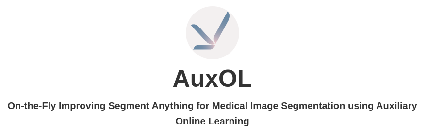
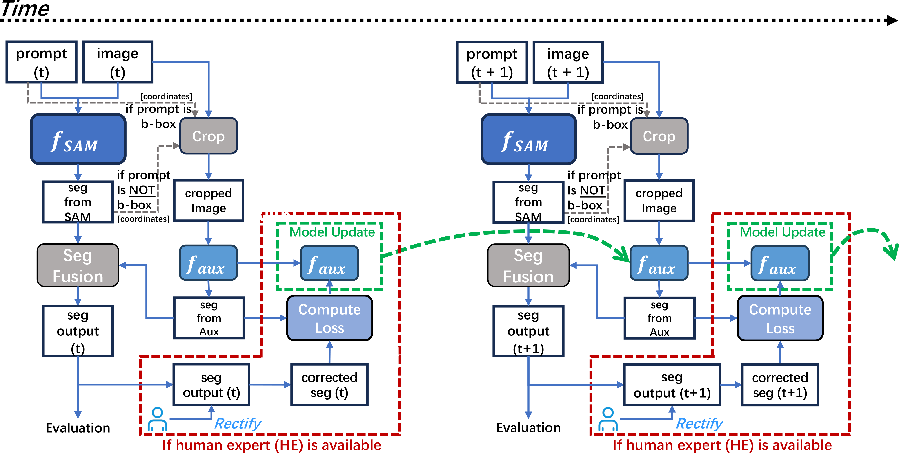

[](https://www.python.org/downloads/release/python-360/)
[](https://github.com/psf/black)


[//]: # ()


<style>
.center-text {
    text-align: center;
    font-size:50px;
    font-weight: bold;
}
.container{
    display: flex;
    justify-content: center;
    align-items: center;
    
}
.container2{
    margin-top:30px;
    display: flex;
    flex-direction: row;
    align-items: center;
    justify-content: center;
}

.con2{
    margin:30px;
    display: flex;
    flex-direction: column;
    align-items: left;
    justify-content: space-around;
}


.item{
    width:150px;
    height:30px;
    align-items:center;
    justify-content:center;
    background-color:#0c0c0c;
    border-radius:20px;
    text-align:center;
    font-size:18px;
    font-weight:bold;
    display:flex;


margin:0 10px;
}

.image{
    background-color: #f3f0f0;
    width:110px;
    height:110px;
    border-radius: 55px;
    padding: 10px;
    font-weight: bold;
    color:white;
    
}
.container2 a{
    color:white;
    margin-left:10px;
}
.image2{
    margin-top:60px;
    display: flex;
    flex-direction: row;
    justify-content: center;
    align-items: center;
}


.checkpoints{
 display: flex;
 justify-content: left;
 flex-direction:row;
 align-items: center;


}

.item_2{
 width:180px;
 height:20px;
 background-color:#f6f5f5;
 /*color:white;*/
 border-radius: 20px;
 margin:10px 10px;
text-align:center;
font-size:12px;
}
.item_2 a{
  
}

</style>


[//]: # (<div class="container">)

[//]: # (<div class="image">)

[//]: # (    )

[//]: # (</div>)

[//]: # (</div>)


[//]: # (<p style="text-align: center;font-size: 50px"><b>AuxOL</b></p>)

[//]: # (<div class="center-text">AuxOL</div>)

[//]: # (<div class="center-text" style="font-size: 20px">On-the-Fly Improving Segment Anything)

[//]: # (for Medical Image Segmentation using Auxiliary Online Learning</div>)

[//]: # (<div class="container2">)

[//]: # ( <div class="item"><a href="https://sam-auxol.github.io/AuxOL/"></a></div>)

[//]: # (    <div class="item"><a href="https://arxiv.org/abs/2406.00956">Arxiv</a></div>)

[//]: # (    <div class="item"><a href="https://arxiv.org/abs/2406.00956">IEEE</a></div>)

[//]: # (</div>)

[//]: # ()
[//]: # (<div class="center-text" style="font-size: 30px;margin-top:40px">Overview</div>)

[//]: # (<div class="image2">)

[//]: # ()

[//]: # (</div>)


# How to Start ?

[//]: # (<div class="center-text" style="font-size: 30px;margin-top:40px">How to Start?</div>)


### Step1 Datasets
1.1 download the example datasets<br/>
1.2 put them into the directory
<div class="checkpoints">
 <div class="item_2"><a href="https://pan.baidu.com/s/1rkt9cHJzkw0xgpwUaNq7lg?pwd=0307">Example Datasets</a></div>
</div>
提取码：0307

### Step2: Checkpoints
2.1 download the checkpoints <br/>
2.2 create a directory named ```checkpoints``` under the root directory <br/>
2.3 put them into the directory  <br/>
 
[//]: # (<style>)

[//]: # ()
[//]: # (</style>)

<div class="checkpoints">
 <div class="item_2"><a href="https://drive.google.com/drive/folders/1ETWmi4AiniJeWOt6HAsYgTjYv_fkgzoN?usp=drive_link">MedSAM checkpoints</a></div>
    <div class="item_2"><a href="https://dl.fbaipublicfiles.com/segment_anything/sam_vit_h_4b8939.pth">SAM checkpoints</a></div>
</div>


### Step3.1:run single 
If you only want to run a single experiment, execute the following command.
```
python main.py
```
### Step3.2:run batch
If you only want to run all experiments, execute the following command.
```
./run.sh
```

### License


The code is licensed under the <span style="color:red;font-weight:bold;margin-right:5px;">MIT</span>license.


### Citation  

If you use AuxOL in your research, please use the following BibTeX entry.
```
 @misc{huang2024improvingsegmentflyauxiliary,
                title={Improving Segment Anything on the Fly:
                Auxiliary Online Learning and Adaptive Fusion for Medical Image Segmentation},
                author={Tianyu Huang and Tao Zhou and Weidi Xie and Shuo Wang and Qi Dou and Yizhe Zhang},
                year={2024},
                eprint={2406.00956},
                archivePrefix={arXiv},
                primaryClass={cs.CV},
                url={https://arxiv.org/abs/2406.00956},
          }
```
